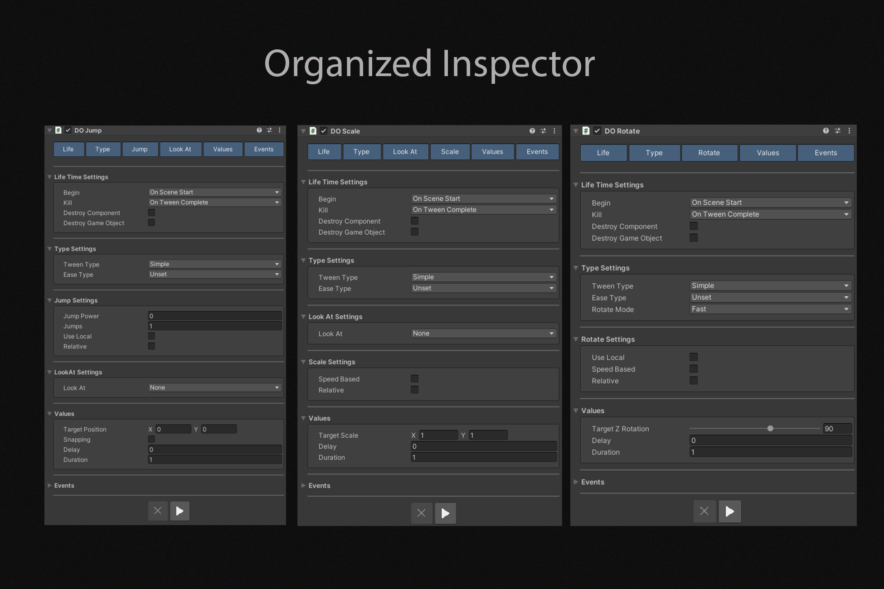
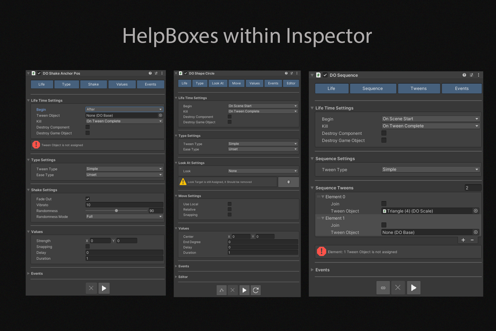
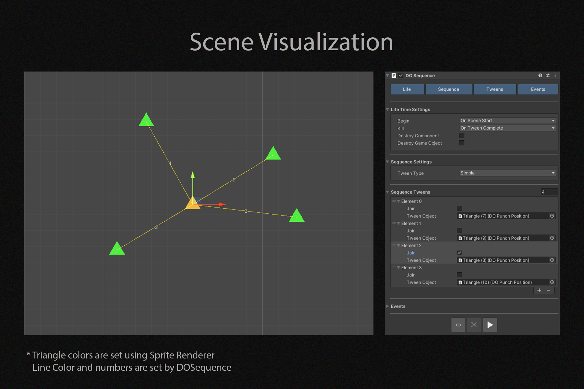
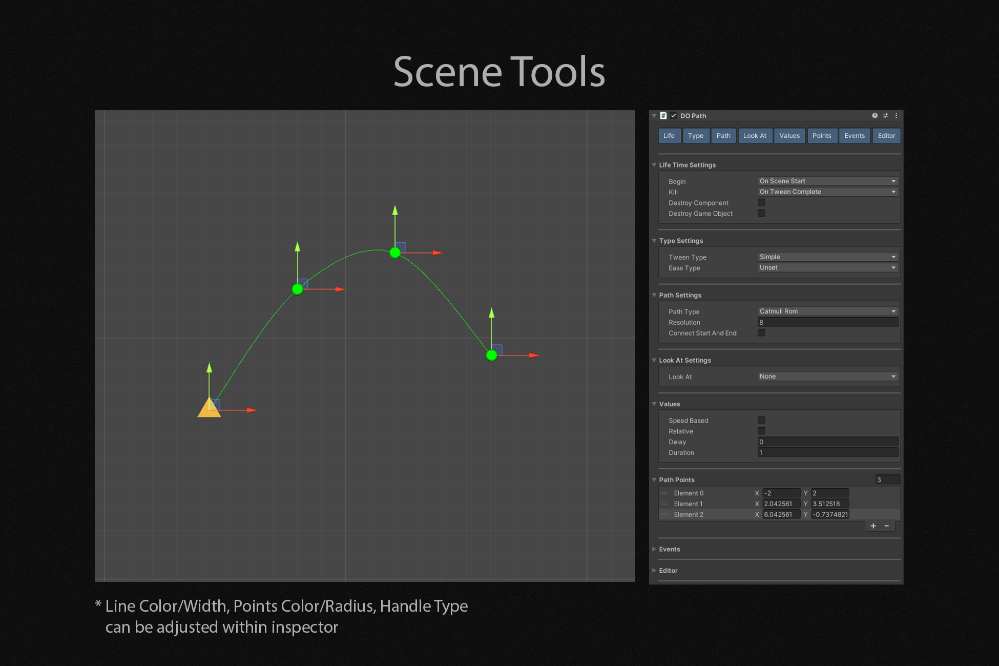
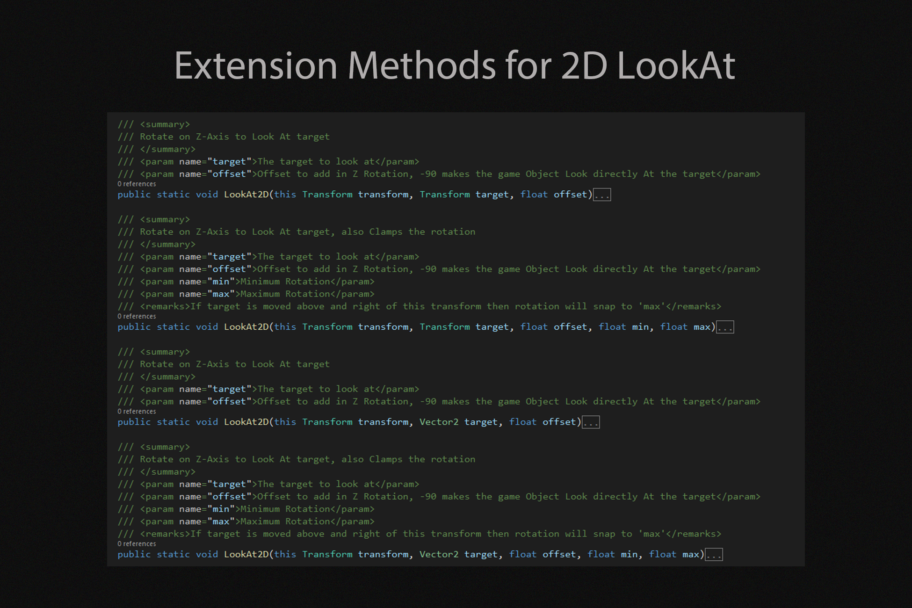
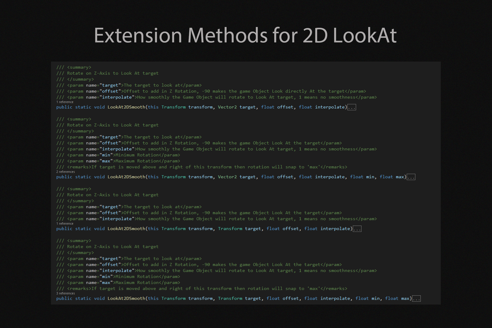
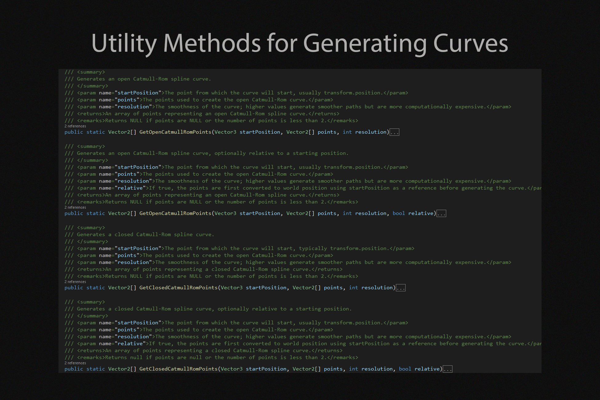
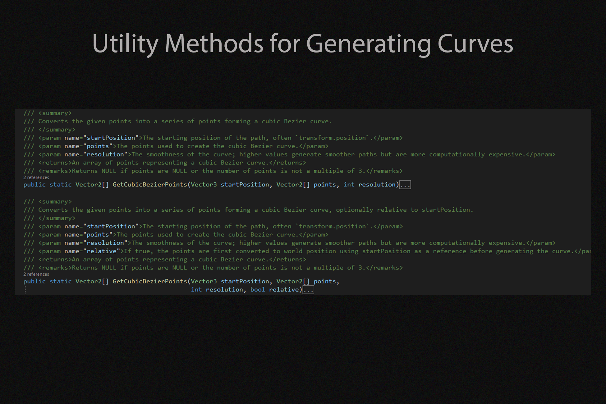
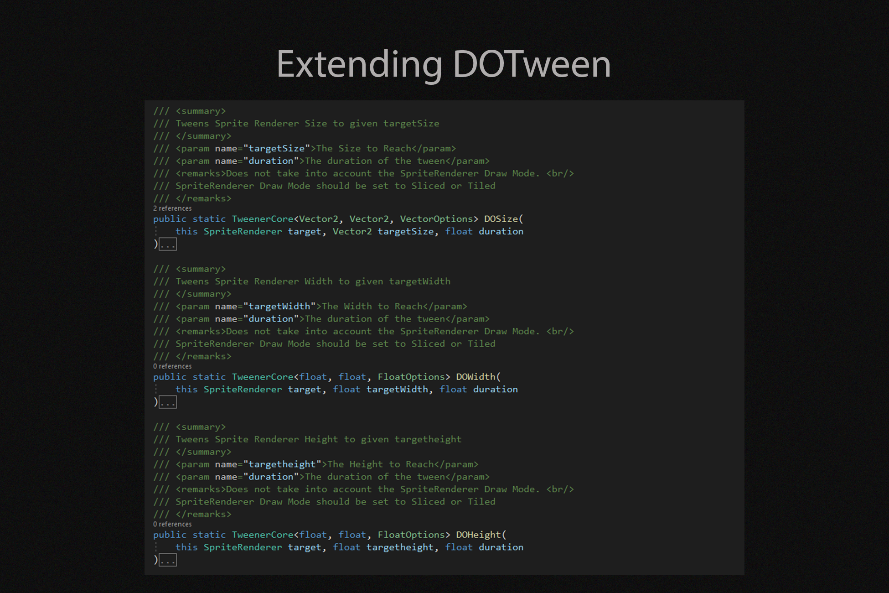
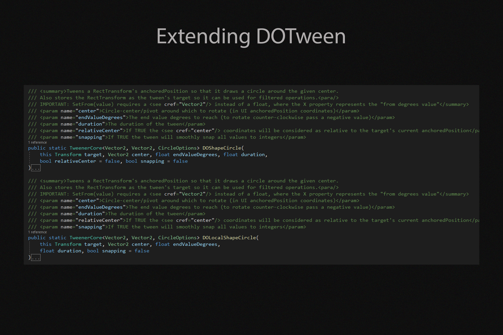

# DOTween Modular 2D
Collection of Modular components for DOTween

## Features

## Prerequisite
- [DOTween](https://assetstore.unity.com/packages/tools/animation/dotween-hotween-v2-27676)
- DOTween asmdef 
(Tools -> Demigiant -> DOTween Utility Panel -> Create ASMDEF)

## Installation
- Window -> Package Manager
- Click **+**, Select **Add Package Form Git URL**
- Paste this URL: https://github.com/AbdurRafay-Nasir/DOTween-Modular-2D.git, Click add
- There will be some errors, ignore them
- Project Window -> Packages -> DOTween Modular 2D -> RIGHT_CLICK -> Show in Explorer
- Cut com.linkedgames.dotweenmodular2d, Paste at YOUR_PROJECT -> Assets -> Plugins
- Add DOTween asmdef reference at com.linkedgames.dotweenmodular2d -> Runtime -> linkedgames.dotweenmoudular2d, Click Apply
(Remove any previous reference)
- Window -> Package Manager -> In Project -> DOTween Modular 2D -> Remove 
-  Add linkedgames.dotweenmoudular2d asmdef reference at com.linkedgames.dotweenmodular2d -> Editor -> linkedgames.dotweenmoudular2d.Editor, Click Apply
(Remove any previous reference)

Now You are ready to use DOTween Modular 2D, also you can rename com.linkedgames.dotweenmodular2d

## Contribute
If you would like to contribute to the package visit this [link](github.com/AbdurRafay-Nasir/DOTween-Modular-2D-Development)

## Author
- Abdur Rafay Nasir
- AbdurRafayNasir1@gmail.com
- https://github.com/AbdurRafay-Nasir
